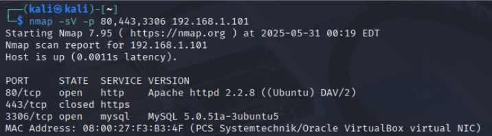
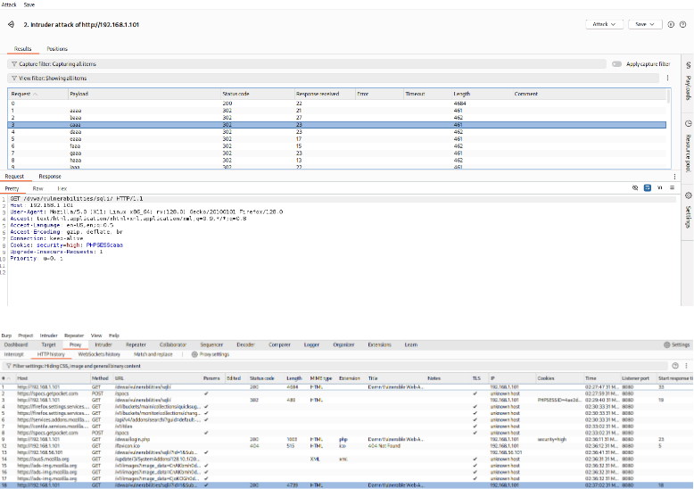
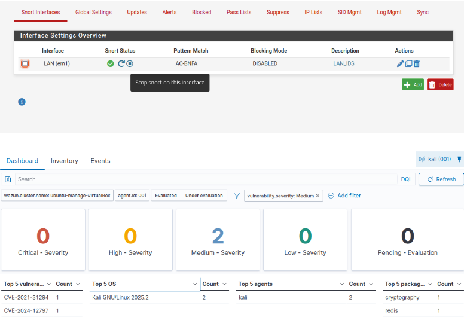

# SQL Injection Defense & Analysis Lab
### Red Team Blue Team Home Practice Range

**Project Status:** Complete | **Classification:** Red Team / Blue Team / Incident Response

## 🎯 Project Goal

Red Team / Blue Team Lab simulating a full **SQL Injection (SQLi)** attack against a vulnerable web application (Metasploitable 2). The attack sequence was executed using professional-grade tools (SQLmap, Burp Suite, John the Ripper) and was monitored and analyzed by an isolated SIEM/IDS defense stack (pfSense, Snort, Wazuh).

## 📁 Technical Documentation

The comprehensive technical analysis, detailed methodology, and full findings for this project are available in the official report.

**[➡️ Download Full Project Report (PDF)](documentation/SQL_Injection_Defense_&_Analysis_Lab.pdf)**

## 💡 Skills Demonstrated

* **Red Team Operations:** Reconnaissance (Nmap, Nikto), vulnerability scanning, traffic manipulation (Burp Suite), exploitation (SQLmap), and post-exploitation (John the Ripper).
* **Blue Team Operations:** Intrusion Detection (Snort) and Security Information and Event Management (Wazuh SIEM).
* **Networking:** Creating isolated network topologies, firewall rule configuration (pfSense), and traffic monitoring.
* **Cybersecurity Frameworks:** Application of the Cyber Kill Chain and referencing MITRE ATT&CK tactics.

## 🛠️ Tools & Technologies Used

* **Virtualization:** VirtualBox
* **Firewall/Router/IDS:** pfSense with Snort
* **SIEM/Monitoring:** Wazuh
* **Attacker OS:** Kali Linux
* **Target OS:** Metasploitable 2 (Vulnerable Web Application)
* **Red Team Tools:** Nmap, Nikto, BurpSuite, SQLmap, John the Ripper
* **Analysis Tools:** Wireshark

---

## ⚙️ Methodology & Topology

### Network Architecture: Isolated Practice Range

The network was configured in VirtualBox to create a **Closed LAN Network (`PF-net`)** for safe testing. This ensures all traffic is contained within the lab environment.

| **pfSense** | Router/Firewall/IDS Host | **LAN Interface:** `PF-net` | 192.168.1.1/24 (Gateway) |
| **Kali Linux** | Attacking Machine (Red Team) | **LAN Interface:** `PF-net` | 192.168.1.107/24 |
| **Metasploitable 2** | Target/Vulnerable Web Server | **LAN Interface:** `PF-net` | 192.168.1.101/24 |
| **Ubuntu Management** | SIEM Host/Monitoring Machine | **LAN Interface:** `PF-net` | 192.168.1.112/24 |

### Logical Topology Diagram

*This diagram illustrates how the components are segmented on the isolated network, with pfSense acting as the central firewall/router.*

```bash
+-------------------------------------------------------------+
|               VIRTUALBOX CLOSED LAB NETWORK (PF-net)        |
+-------------------------------------------------------------+
               |
               | (Private LAN Traffic)
               |
+--------------V----------------------------------------------+
|                   pfSense Router (192.168.1.1)              |
|                   (HOSTING SNORT IDS)                       |
+-------------------------------------------------------------+
        |           |           |           
        |           |           |           
        V           V           V           
+-----------+ +-----------+ +-----------+ +-------------------+
| KALI LINUX| | METASPLOIT| | UBUNTU MGMT| | External/WAN Side |
| (1.107)   | | (1.101)   | | (1.112)    | | (Isolated/NAT)    |
+-----------+ +-----------+ +-----------+ +-------------------+
 (Attacker)   (Target)      (Wazuh SIEM)    (Internet Access Blocked)
```

---

## ⚠️ Important Caution on Networking

***
The **IP addresses** used in this documentation are for example and testing purposes only. They belong to the private address space (RFC 1918) and are not real public addresses. You must ensure any IP addresses you use are available on your own lab network; they will likely be different if you try to recreate this project on a different host machine.
***
---

## 📸 Validation and Proof of Concept

The following visual evidence validates the entire Red Team / Blue Team exercise, demonstrating the full Cyber Kill Chain lifecycle and the corresponding security analysis.

### 1. Reconnaissance and Vulnerability Analysis (Tools: Nmap, Nikto, Burp Suite)

This phase confirms that the target system was scanned and vulnerable points were precisely identified before the attack began.

* **Nmap Port Scan:** Confirms the target's open ports, including 80 (HTTP) and 3306 (MySQL), which host the vulnerable application.
    

* **Nikto Vulnerability Scan:** Confirms the vulnerable services running on the web server, identifying specific, known weaknesses on the target IP (192.168.1.101).
    

* **Burp Suite Intruder Attack:** Shows the execution of the attack on the target's login page, demonstrating the ability to manually test for vulnerabilities and manipulate network traffic.
    

### 2. Exploitation and Data Exfiltration (Tool: SQLmap)

This section provides the central proof of the attack's success, confirming the database vulnerability was leveraged to extract critical data.

* **SQLmap Database Extraction:** Confirms the success of the SQL injection by showing the names of the databases that were successfully extracted from the vulnerable application.
    

### 3. Post-Exploitation (Tool: John the Ripper)

This phase showcases advanced Red Team skills in cracking stolen credentials for potential subsequent access or lateral movement within the network.

* **Hash Cracking (John the Ripper):** Shows a stolen password hash (from the vulnerable application) being successfully cracked against a wordlist, confirming the viability of the exfiltrated credential data.
    

### 4. Blue Team Detection and Analysis (Tools: Snort, Wazuh SIEM)

This final phase validates the defensive architecture, proving that monitoring tools correctly detected, logged, and analyzed the entire attack sequence.

* **Snort and Wazuh Detection:** Confirms that the active monitoring system logged the intrusion attempt, with Snort identifying the traffic and Wazuh logging the event.
    

* **Wazuh MITRE ATT&CK Breakdown:** Confirms the SIEM provided a sophisticated, high-level analysis of the attack, automatically mapping the event to the correct MITRE ATT&CK tactics (e.g., Initial Access, Execution).
    

---

## 🧠 Lessons Learned & Next Steps (Reflection)

### Lessons Learned

* This project provided a deeper understanding of the way actual cyberattacks happen and the way blue teamers pick up on them through the use of tools like Snort, and Wazuh.
* It reinforced the use of security frameworks such as the Cyber Kill Chain and was hands-on with fundamental networking concepts.
* Troubleshooting connectivity issues and configuring multiple security tools taught persistence and complex system integration skills essential for a SOC role.

### Next Steps

* Configure active blocking rules in pfSense/Snort to move from a purely **Intrusion Detection System (IDS)** to an **Intrusion Prevention System (IPS)**.
* Integrate automated reporting to generate a summary of the attack findings immediately after a simulation run.

---

## 🔒 Ethical & Security Compliance

This project is for **educational and portfolio purposes only**. All activity was contained within a dedicated, isolated virtual environment. **No real credentials or confidential information were used.** The target machine (Metasploitable 2) is intentionally designed to be vulnerable for security testing.
